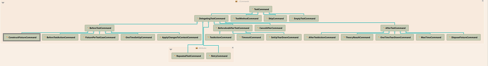
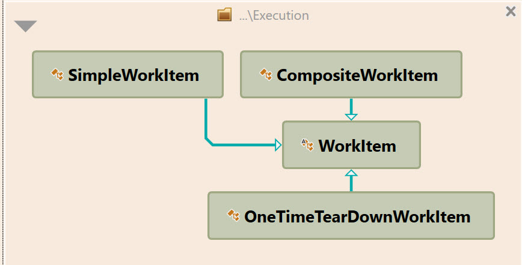

# Class diagrams related to commands

## TestCommand hierarchy

## WorkItem hierarchy

NOTE: There are more Item classes in the system, but they don't have WorkItem as a parent class. They are not shown here.
